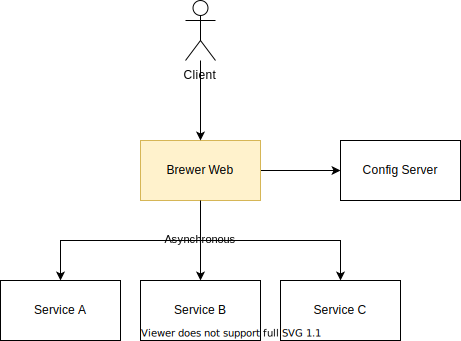

# Brewer Web

A containerized micro service which provides web content (HTML, CSS, JS) for the _Brewer_ project.

## Dependencies

- [Config Server](https://github.com/bandrefilipe/config-server "Github")

## Employed Technology

|||||||
|:---:|:---:|:---:|:---:|:---:|:---:|
- Java 11
- Spring Boot 2
  - Web MVC
- Spring Cloud Config
- Spring Cloud Circuit Breaker
  - Resilience4j
- Thymeleaf 3
- Bootstrap 3
- Javascript
- Docker
- Gradle
